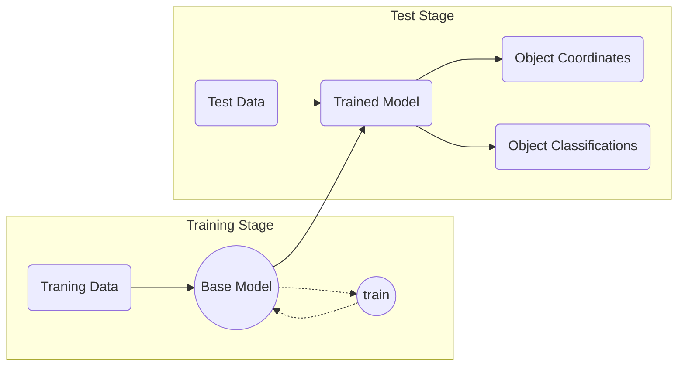

# Object Detection Model for Urban Infrastructure

### Introduction
This project is used in detection for **urban infrastructures** from input of ***[Orthomosaic](https://www.dronegenuity.com/orthomosaic-maps-explained/) images*** , more precisely,  small infrastructures on the street such as the ***manhole cover***, ***utility shaft***, ***water valve cover***, ***gas valve cover***, ***underground hydrant***, ***stormwater inlet***, etc. 

Here are some example of patterns for different objects:

The model can be trained on the local computer without additional huge computation resource. After the model is well-trained, it is able to detect classified objects from arbitrary input images.

And here is a flow chart for the pipeline:

### Preparing your environment

Get yourself a Python>=3.10 environment. Using a  [virtualenv](https://packaging.python.org/en/latest/guides/installing-using-pip-and-virtual-environments/#creating-a-virtual-environment)  is recommended but not required.

You'll need a few tools to run scripts in this distribution. They are specified in the requirements.txt file. Install them with pip:

> python -m pip install -r requirements.txt

and also install [Detectron2](https://github.com/facebookresearch/detectron2):
>git clone https://github.com/facebookresearch/detectron2.git
>
>python -m pip install -e detectron2

This project contains some foundation models such as:
- [Faster R-CNN](https://arxiv.org/abs/1506.01497)
- [YOLOv5](https://arxiv.org/html/2407.20892v1) (**Y**ou **O**nly **L**ook **O**nce)
- [SSD](https://arxiv.org/abs/1512.02325) (**S**ingle **S**hot Multibox **D**etector)
- [RetinaNet](https://arxiv.org/abs/1708.02002)
- [Cascade R-CNN](https://arxiv.org/abs/1712.00726)

### TODO

