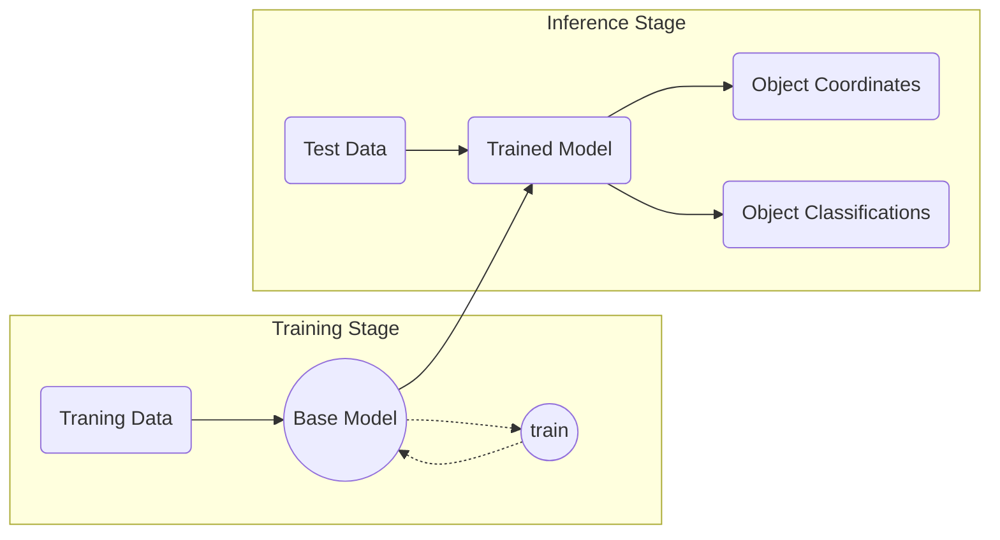

# Object Detection Model for Urban Infrastructure

### Introduction
This project is used in detection for **urban infrastructures** from input of ***[Orthomosaic](https://www.dronegenuity.com/orthomosaic-maps-explained/) images*** , more precisely,  small infrastructures on the street such as the ***manhole cover***, ***utility shaft***, ***water valve cover***, ***gas valve cover***, ***underground hydrant***, ***stormwater inlet***, etc. 

The model can be trained on the local computer without additional huge computation resource. After the model is well-trained, it is able to detect classified objects from arbitrary input images.

And here is a flow chart for the pipeline:

### Preparing your environment

Get yourself a Python=3.9 environment. Using a  [virtualenv](https://packaging.python.org/en/latest/guides/installing-using-pip-and-virtual-environments/#creating-a-virtual-environment)  is recommended but not required.

You'll need a few tools to run scripts in this distribution. They are specified in the requirements.txt file.

Install them with pip: (assume you are in the root directory of the project)
> python -m pip install -r requirements.txt

and also install [Detectron2](https://github.com/facebookresearch/detectron2):
>python -m pip install -e detectron2
(If it throws a error "No Moduel named xxx", use install command below instead)
>pip install --no-build-isolation 'git+https://github.com/facebookresearch/detectron2.git'
or
>pip install --no-build-isolation -e detectron2

and install the project as a package (otherweise scripts cannot recognize the project root path)
>pip install -e .

This project contains models:
- [Faster R-CNN](https://arxiv.org/abs/1506.01497)
- [Cascade R-CNN](https://arxiv.org/abs/1712.00726)
- [YOLOv8](https://arxiv.org/html/2407.20892v1) (**Y**ou **O**nly **L**ook **O**nce)
- [RetinaNet]
- [RT-DETR]

Few-Shot Detection models:
- [FsDet(TFA)]

SAHI Framwork is applied in this project:
- [How to detect small objects in large images](https://blog.ml6.eu/how-to-detect-small-objects-in-very-large-images-70234bab0f98)

### Some Common Errors 

### TODO
Few-shot object detection model

tutorial

Docker